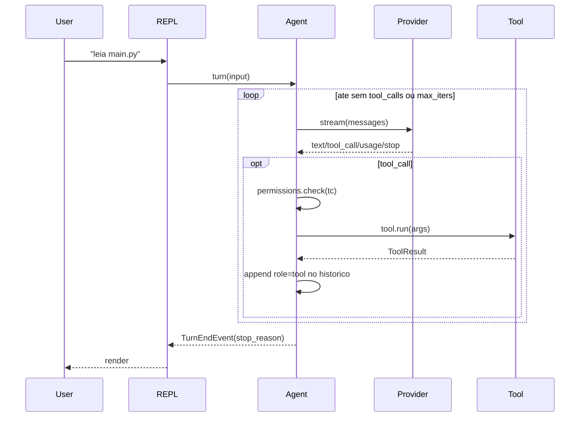

# Tarefa 02.03 - Conceitos Principais

**Status**: PENDENTE
**Fase**: 02 - Getting Started
**Dependencias**: 02.02
**Bloqueia**: nada (ultima da fase 02)

---

## Objetivo

Criar `getting-started/core-concepts.md` introduzindo o vocabulario do vulpcode:
agente, provider, tool, registry, sessao, permissao. E uma pagina conceitual,
nao tutorial.

---

## Arquivos a criar

- `docs/getting-started/core-concepts.md`

---

## Source de verdade

- `src/vulpcode/agent.py` — classe `Agent`, eventos
- `src/vulpcode/providers/base.py` — `Provider` ABC, `Message`, `StreamChunk`
- `src/vulpcode/tools/base.py` — `Tool` ABC, `@tool`, `TOOL_REGISTRY`
- `src/vulpcode/permissions.py` — `Mode`, `PermissionManager`
- `src/vulpcode/session.py` — persistencia de mensagens

---

## Estrutura sugerida

### 1. Visao geral em 1 paragrafo

Vulpcode tem um **Agent** que conversa com um **Provider** (Claude, GPT, Ollama,
...) e tem acesso a um conjunto de **Tools** (Read, Bash, Write, ...). Quando
o modelo decide usar uma tool, o **PermissionManager** decide se executa, e a
**Session** guarda o historico.

Acompanhar com diagrama em `mermaid` (ja habilitado via material) ou ASCII
art mostrando o fluxo: User -> Repl -> Agent -> Provider -> Agent -> Tool ->
Agent -> User.

### 2. Provider

- O que e
- Como traduz mensagens canonicas para o formato do modelo
- 3 categorias: dedicados (`anthropic`, `gemini`, `ollama`, `internal-llm`),
  OpenAI-compativeis (`openai`, `deepseek`, `groq`, ...), externos via MCP
- Streaming vs nao-streaming
- Tabela compacta com 10 providers, link para `providers/index.md`

### 3. Tool

- O que e
- Decorator `@tool(name, description, requires_confirm)`
- `Input` model (Pydantic v2)
- `run(args) -> ToolResult`
- Lista das 14 tools nativas
- Como o Agent descobre tools (TOOL_REGISTRY)
- Link para `tools/index.md`

### 4. Agent loop

- O loop classico: stream -> coletar tool_calls -> executar tools -> repetir
- `_max_iters = 25` (limite de seguranca)
- Eventos emitidos: `TextEvent`, `ToolStartEvent`, `ToolEndEvent`, `UsageEvent`,
  `TurnEndEvent`, `ErrorEvent`
- Diagrama de sequencia em mermaid

### 5. Permissoes

- Modo `default`: pede confirmacao para tools com `requires_confirm=True`
- Modo `auto`: aprova tudo
- Modo `safe`: pede ate para reads
- Modo `plan`: bloqueia tudo
- Allowlist por sessao (`a` quando perguntar)
- Allowlist persistente via `permissions.always_allow_tools`

### 6. Sessao

- Historico de mensagens vive em `Agent._messages`
- `/save <name>` persiste em `~/.vulpcode/sessions/<name>.json`
- `/load <name>` carrega
- `--resume` carrega a mais recente

### 7. MCP (one-liner aqui, link para mcp/)

Servidores MCP estendem o registry de tools com tools externas. Configuracao em
`~/.vulpcode/config.toml` secao `[[mcp.servers]]`.

### 8. Streaming, tokens e limites

- Output e tokenizado pelo provider; vulpcode reporta `input_tokens` e
  `output_tokens` por turno
- `max_tokens` configuravel (default 16384)
- `stop_reason` exposto no fim do turno (`end_turn`, `tool_use`, `max_tokens`,
  `stop_sequence`)

---

## Diagrama mermaid sugerido (agent loop)

````markdown

````

---

## INSTRUCAO CRITICA

- Conceitual, nao operacional. Comandos vao para `user-guide/`.
- Cada secao deve **linkar** para a pagina detalhada da secao correspondente:
  Provider -> `providers/index.md`, Tool -> `tools/index.md`, etc.
- Mantenha cada secao em ~5-10 linhas. Profundidade vai para outras paginas.

---

## Etapas de Implementacao

### Etapa 1: Ler os arquivos source listados
### Etapa 2: Criar `getting-started/core-concepts.md`
### Etapa 3: Validar com mkdocs serve (visual + diagramas mermaid)
### Etapa 4: Build sem --strict

---

## Criterios de Aceite

- [x] `docs/getting-started/core-concepts.md` criado
- [x] Visao geral em 1 paragrafo
- [x] Secoes: Provider, Tool, Agent loop, Permissoes, Sessao, MCP, Streaming/tokens
- [x] Pelo menos 1 diagrama mermaid (agent loop)
- [x] Cada secao linkada para a pagina detalhada (mesmo que nao exista ainda)
- [x] Lista das 14 tools nativas (Read, Write, Edit, MultiEdit, Glob, Grep, Bash, BashOutput, KillBash, WebFetch, WebSearch, Task, TodoWrite, NotebookEdit)
- [x] Lista dos 10 providers
- [x] `mkdocs build` continua passando

---

## Riscos

| Risco | Mitigacao |
|-------|-----------|
| Mermaid plugin nao habilitado | Material ja suporta nativamente desde 9.x |
| Pagina virar muito longa | Manter cada secao curta com links externos |

---

**End of Specification**
