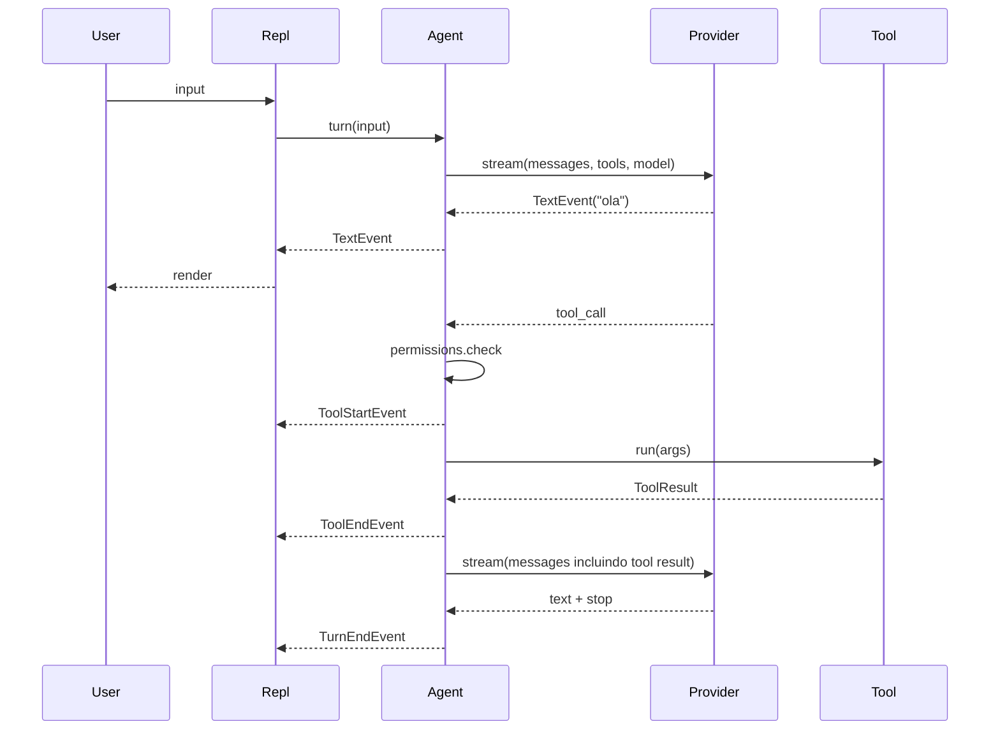

# Tarefa 10.01 - Internals: Agent Loop + Streaming

**Status**: PENDENTE
**Fase**: 10 - Arquitetura
**Dependencias**: 09.03
**Bloqueia**: 10.02

---

## Objetivo

Criar `architecture/index.md` e `architecture/agent-loop.md` +
`architecture/streaming.md` explicando como o loop e o streaming visual funcionam
internamente. Para contribuidores e curiosos.

---

## Arquivos a criar

- `docs/architecture/index.md`
- `docs/architecture/agent-loop.md`
- `docs/architecture/streaming.md`

---

## Source de verdade

- `src/vulpcode/agent.py`
- `src/vulpcode/ui/streaming.py`
- `src/vulpcode/ui/render.py`
- `src/vulpcode/ui/repl.py`

---

## Conteudo de `architecture/index.md`

Indice da secao:

- [Agent loop](agent-loop.md) — como o turno do agente roda
- [Streaming](streaming.md) — como eventos do agente viram UI
- [Provider translation](provider-translation.md) — em 10.02
- [Tool registry](tool-registry.md) — em 10.02

---

## Conteudo de `architecture/agent-loop.md`

### 1. O loop

Pseudocodigo do `Agent.turn()`:

```python
async def turn(self, user_input: str) -> AsyncIterator[Event]:
    self._messages.append(Message(role="user", content=user_input))
    for _ in range(self._max_iters):
        text_buffer = ""
        tool_calls = []
        async for chunk in self.provider.stream(...):
            if chunk.type == "text": yield TextEvent(...); text_buffer += ...
            elif chunk.type == "tool_call": tool_calls.append(chunk.tool_call)
            elif chunk.type == "usage": yield UsageEvent(...)
            elif chunk.type == "stop": stop_reason = chunk.stop_reason; break
            elif chunk.type == "error": yield ErrorEvent(...); return

        self._messages.append(Message(role="assistant", content=text_buffer, tool_calls=tool_calls))

        if not tool_calls:
            yield TurnEndEvent(stop_reason or "end_turn")
            return

        for tc in tool_calls:
            decision = await self.permissions.check(tc, tool_cls)
            if not decision.allow: yield ToolDeniedEvent(...); continue
            yield ToolStartEvent(tc)
            result = await tool.run(args)
            yield ToolEndEvent(tc, result)
            self._messages.append(Message(role="tool", ...))
    yield ErrorEvent("Max iterations reached")
```

### 2. Eventos emitidos

Diagrama mermaid sequencial mostrando ordem de eventos numa turn que tem
1 tool call.



### 3. Salvaguardas

- `_max_iters = 25` previne loops infinitos
- `ProviderError` capturado vira `ErrorEvent` (turn termina)
- Tool execution em try/except — falha vira `is_error=True` no result, agente
  ve e pode adaptar
- Tool desconhecida (nao no registry) ainda emite mensagem role=tool, agente ve
  o erro

### 4. Decisoes de design

- **Streaming via async generator** vs callback: composabilidade — qualquer
  consumer pode `async for ev in agent.turn(...)`.
- **Mensagens canonicas**: o Agent nao sabe qual provider esta por baixo;
  Provider traduz.
- **Permissions injetadas**: facilita teste e custom UIs.
- **Historico mutavel** (`_messages`): turns subsequentes continuam a conversa.
  `reset()` limpa.

---

## Conteudo de `architecture/streaming.md`

### 1. Stream pipeline

Provider raw events -> StreamChunk canonicos -> Agent eventos -> Renderer (Rich)
-> Terminal.

### 2. StreamChunk types

(Tabela: `text`, `tool_call`, `tool_call_delta`, `usage`, `stop`, `error`)

### 3. Como o renderer roteia

`stream_agent_turn()` dispatcha:

| Event           | Action                                     |
|-----------------|--------------------------------------------|
| TextEvent       | render_text_chunk (delta inline)           |
| ToolStartEvent  | render_tool_start (panel) + spinner        |
| ToolEndEvent    | render_tool_end (panel) + spinner          |
| ToolDeniedEvent | render_tool_denied (warning line) + spinner|
| UsageEvent      | render_usage (linha cinza)                 |
| ErrorEvent      | render_error (linha vermelha)              |
| TurnEndEvent    | render_turn_end + show stop_reason         |

### 4. Spinner-aware prompter

`stream_agent_turn` instala um wrapper na `agent.permissions.prompter` que
para o `Live(spinner)` antes de chamar o prompter original (stdin) e religa
depois. Sem isso, o Rich Live confunde stdin.

Codigo simplificado:

```python
async def _spinner_aware_prompter(msg, ctx):
    stop_spinner()
    try:
        return await original_prompter(msg, ctx)
    finally:
        start_spinner("Thinking...")
agent.permissions.prompter = _spinner_aware_prompter
```

### 5. Multi-provider streaming differences

| Provider     | Streaming style                 | Tool calls         |
|--------------|---------------------------------|--------------------|
| Anthropic    | SSE com Raw* events             | input_json_delta agregado por index |
| OpenAI       | SSE com ChatCompletionChunk     | tool_calls fragmentos por index, agregados ate finish_reason |
| Gemini       | AsyncIterator generate_content_stream | function_call vem completo |
| Ollama       | NDJSON (uma linha JSON por chunk) | tool_calls completos no chunk |
| internal-llm | Sem streaming — envia 1 text + stop | nao suporta |

---

## Atualizar `mkdocs.yml`

Adicionar bloco `Arquitetura`:

```yaml
- Arquitetura:
    - architecture/index.md
    - Agent loop: architecture/agent-loop.md
    - Streaming: architecture/streaming.md
    - Provider translation: architecture/provider-translation.md   # 10.02
    - Tool registry: architecture/tool-registry.md                 # 10.02
```

---

## INSTRUCAO CRITICA

- Usar mermaid para diagramas (Material suporta nativamente).
- Codigo no `agent-loop.md` deve refletir o loop REAL — confira `agent.py`
  antes de fechar.

---

## Etapas de Implementacao

### Etapa 1: Ler `agent.py`, `ui/streaming.py`, `ui/render.py`
### Etapa 2: Criar 3 arquivos
### Etapa 3: Atualizar `mkdocs.yml`
### Etapa 4: `mkdocs build` — verificar diagramas mermaid

---

## Criterios de Aceite

- [x] `docs/architecture/index.md` criado
- [x] `docs/architecture/agent-loop.md` com pseudocodigo + diagrama mermaid + decisoes
- [x] `docs/architecture/streaming.md` com pipeline + StreamChunk types + roteamento + spinner-aware
- [x] `mkdocs.yml` atualizado
- [x] Diagrama mermaid renderiza
- [x] `mkdocs build` continua passando

---

**End of Specification**
