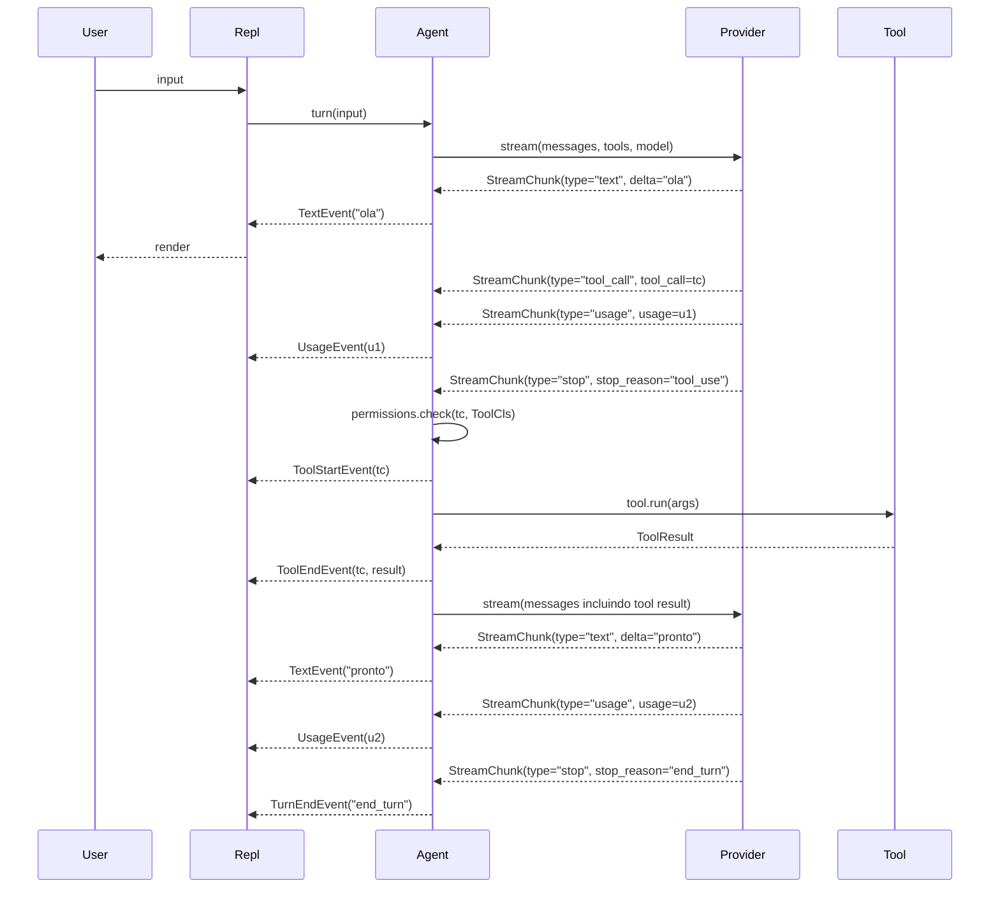

# Agent loop

O **Agent loop** e o coracao do Vulpcode. Ele orquestra a conversa entre
o usuario, o LLM e as tools — e emite um stream de eventos canonicos que
qualquer UI (REPL, headless, testes) pode consumir.

O codigo vive em [`src/vulpcode/agent.py`](https://github.com/vulpcode/vulpcode/blob/main/src/vulpcode/agent.py).
Para a referencia tipada, ver [API: Agent](../api/agent.md).

---

## 1. O loop

`Agent.turn(user_input)` e um `async generator`. A cada turno ele:

1. Anexa a mensagem do usuario ao historico canonico (`self._messages`).
2. Chama `provider.stream(...)` e consome chunks ate ver `stop` ou `error`.
3. Constroi a mensagem `assistant` (com texto agregado e tool calls) e
   anexa ao historico.
4. Se nao ha tool calls, emite `TurnEndEvent` e termina.
5. Para cada tool call: checa permissao, executa, emite eventos e anexa o
   resultado ao historico (com `role="tool"`).
6. Volta ao passo 2 (proxima iteracao do for-loop).

Pseudocodigo simplificado, fiel ao real:

```python
async def turn(self, user_input: str) -> AsyncIterator[Event]:
    self._messages.append(Message(role="user", content=user_input))
    for _ in range(self._max_iters):
        text_buffer = ""
        tool_calls: list[ToolCall] = []
        stop_reason: str | None = None
        try:
            async for chunk in self.provider.stream(
                messages=self._messages,
                tools=self._tool_schemas(),
                model=self.model,
                system=self.system,
                **self.model_settings,
            ):
                if chunk.type == "text" and chunk.delta:
                    text_buffer += chunk.delta
                    yield TextEvent(chunk.delta)
                elif chunk.type == "tool_call" and chunk.tool_call is not None:
                    tool_calls.append(chunk.tool_call)
                elif chunk.type == "usage" and chunk.usage is not None:
                    self._session_usage += chunk.usage  # acumula
                    yield UsageEvent(chunk.usage)
                elif chunk.type == "stop":
                    stop_reason = chunk.stop_reason
                    break
                elif chunk.type == "error":
                    yield ErrorEvent(chunk.error or "unknown stream error")
                    return
        except ProviderError as exc:
            yield ErrorEvent(str(exc))
            return

        self._messages.append(
            Message(
                role="assistant",
                content=text_buffer,
                tool_calls=tool_calls or None,
            )
        )

        if not tool_calls:
            yield TurnEndEvent(stop_reason or "end_turn")
            return

        for tc in tool_calls:
            tool_obj = self.tools.get(tc.name)
            if tool_obj is None:
                self._messages.append(
                    Message(role="tool", tool_call_id=tc.id, name=tc.name,
                            content=f"Unknown tool: {tc.name}")
                )
                yield ErrorEvent(f"Unknown tool: {tc.name}")
                continue

            tool_cls = type(tool_obj)
            decision = await self.permissions.check(tc, tool_cls)
            if not decision.allow:
                yield ToolDeniedEvent(tc, decision.reason)
                self._messages.append(
                    Message(role="tool", tool_call_id=tc.id, name=tc.name,
                            content=f"Cancelled: {decision.reason}")
                )
                continue

            yield ToolStartEvent(tc)
            try:
                args = tool_cls.parse_args(tc.arguments or {})
                result = await tool_obj.run(args)
            except Exception as exc:
                result = ToolResult(
                    error=f"{type(exc).__name__}: {exc}", is_error=True
                )
            yield ToolEndEvent(tc, result)
            self._messages.append(
                Message(role="tool", tool_call_id=tc.id, name=tc.name,
                        content=result.to_string())
            )

    yield ErrorEvent(f"Max iterations ({self._max_iters}) reached")
```

Pontos a notar:

- O **system prompt** e passado em `provider.stream(system=...)`, **fora** do
  `messages`. O historico canonico nao contem `role="system"`.
- O **texto do assistant** e agregado num buffer; o `TextEvent` e emitido
  por delta para a UI conseguir streamar, mas o que vai para o historico e
  o texto inteiro.
- **Tool calls** sao acumuladas durante o stream e processadas em batch
  apos o `stop`. Isto permite o modelo pedir varias tools em paralelo num
  unico turno.
- **Tool desconhecida** ainda gera uma mensagem `role="tool"` com o erro
  antes de emitir `ErrorEvent`, para que o modelo veja a falha caso o loop
  continue (atualmente o `continue` mantem o loop vivo).

---

## 2. Eventos emitidos

Sequencia de eventos numa turn que tem **uma** tool call:



Cada evento e um dataclass tipado em `vulpcode.agent`:

| Evento              | Quando e emitido                                            |
|---------------------|-------------------------------------------------------------|
| `TextEvent`         | A cada delta de texto streamado pelo provider               |
| `UsageEvent`        | Provider reportou token accounting para a resposta atual    |
| `ToolStartEvent`    | Logo antes de `tool.run(args)` (ja com permissao aprovada)  |
| `ToolEndEvent`      | Apos `tool.run(args)`, com o `ToolResult` (sucesso ou erro) |
| `ToolDeniedEvent`   | Permissao negou a tool call (modelo ve um `Cancelled: ...`) |
| `TurnEndEvent`      | Turno terminou sem novas tool calls (`stop_reason` carrega) |
| `ErrorEvent`        | Falha de provider, tool desconhecida ou `max_iters` atingido|

Apos `TurnEndEvent` ou `ErrorEvent` o generator termina. Chame `turn()` de
novo para continuar a conversa (o historico e mantido em `self._messages`).

---

## 3. Salvaguardas

| Salvaguarda                    | Comportamento                                         |
|--------------------------------|-------------------------------------------------------|
| `_max_iters = 25`              | Cap de iteracoes por turno; previne loops infinitos   |
| `ProviderError` capturado      | Convertido em `ErrorEvent`; turn termina graciosamente |
| Tool em try/except             | Excecao vira `ToolResult(is_error=True)`; modelo ve o erro e pode adaptar |
| Tool desconhecida              | Mensagem `role="tool"` com `Unknown tool: X` + `ErrorEvent` |
| `decision.allow == False`      | `ToolDeniedEvent` + mensagem `role="tool"` com `Cancelled: <reason>` |

`_max_iters` e atingido se o modelo entrar num ciclo de tool-calling
infinito (por exemplo, sempre pedir uma tool que falha). O agente para,
emite `ErrorEvent("Max iterations (25) reached")` e devolve o controle.

---

## 4. Decisoes de design

**Streaming via `AsyncIterator[Event]`**, nao callbacks.
Composabilidade: qualquer consumer pode `async for ev in agent.turn(...)`.
Tests, UIs alternativas e o REPL usam o mesmo gerador. Callbacks acoplam
o produtor ao consumer e tornam testes mais frageis.

**Mensagens canonicas** (`Message`, `ToolCall`, `Usage`).
O Agent nao sabe qual provider esta por baixo. O `Provider.stream(...)`
recebe mensagens canonicas e devolve `StreamChunk` canonicos — toda a
traducao SDK-especifica vive nas adaptadores. Trocar de provider em
runtime nao requer recompor o historico.

**Permissions injetadas**.
`Agent(permissions=...)` recebe um `PermissionManager`. Isso facilita:

- testes (mockar `check()` e trivial),
- UIs custom (web pode plugar um prompter HTTP),
- modos diferentes (`auto`, `safe`, `plan`) sem ramificacoes no Agent.

**Historico mutavel** (`self._messages`).
Turnos subsequentes continuam a conversa porque o historico persiste no
agente. `agent.reset()` limpa para iniciar uma sessao do zero. Sessoes
persistidas em disco (ver [Sessoes](../user-guide/sessions.md)) sao
serializacao de `self._messages`.

**Texto agregado, deltas emitidos**.
A UI ve `TextEvent` por delta (para streaming visual fluido), mas o
historico recebe a string completa de uma vez. Isso evita N mensagens
`assistant` por turno e mantem o transcript limpo.

**Tool batching dentro do turno**.
O modelo pode pedir varias tool calls num unico stream; todas sao
coletadas, depois executadas em sequencia. O resultado de cada uma vira
uma mensagem `role="tool"` separada — o modelo recupera todos os
resultados na proxima iteracao.

---

## 5. Convenience: `run_to_completion`

Para callers nao-streaming (scripts, batch, testes), existe um wrapper:

```python
text = await agent.run_to_completion("escreva um haiku sobre Python")
```

Internamente, ele consome `turn()` ate o final, descarta tudo que nao for
`TextEvent`, agrega o texto e devolve. Em caso de `ErrorEvent`, retorna o
texto parcial coletado ate ali.

---

## Veja tambem

- [Streaming](streaming.md) — como esses eventos viram UI no terminal.
- **Provider translation** (em 10.02) — o que o `provider.stream()` faz
  por baixo dos panos.
- **Tool registry** (em 10.02) — como `self.tools` e populado.
- [API: Agent](../api/agent.md) — referencia tipada gerada de `agent.py`.
