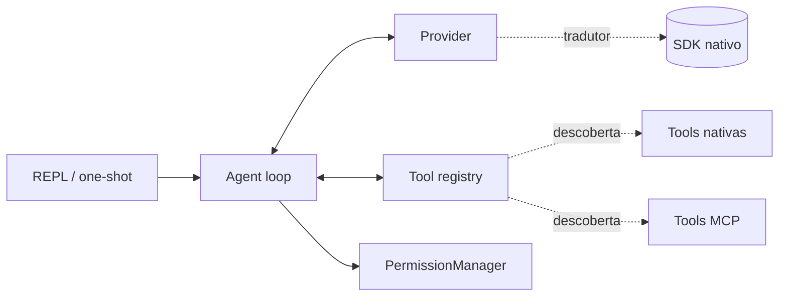

# Arquitetura

Esta secao e para **contribuidores** e leitores curiosos que querem saber
como o Vulpcode esta montado por dentro. Para usar o CLI, o
[Guia do Usuario](../user-guide/index.md) e suficiente.

O Vulpcode e composto por quatro camadas:

| Camada           | Responsabilidade                                         | Codigo principal                       |
|------------------|----------------------------------------------------------|----------------------------------------|
| UI               | Entrada do usuario, render de eventos                    | `vulpcode.ui.repl`, `vulpcode.ui.render` |
| Agent loop       | Conversa, ciclo de tool-calling, eventos canonicos       | `vulpcode.agent`                       |
| Provider         | Traducao do contrato canonico para o SDK do fornecedor   | `vulpcode.providers.*`                 |
| Tool registry    | Descoberta, schema e execucao de tools                   | `vulpcode.tools.*`                     |

## Indice da secao

- [Agent loop](agent-loop.md) — como um turno do agente roda do inicio ao fim,
  quais eventos sao emitidos e quais salvaguardas existem.
- [Streaming](streaming.md) — como eventos do agente viram UI no terminal,
  o pipeline de chunks, e a interacao com o spinner do Rich.
- [Provider translation](provider-translation.md) — como mensagens
  canonicas e tool schemas sao traduzidos para cada SDK (Anthropic, OpenAI,
  Gemini, Ollama, internal-llm).
- [Tool registry](tool-registry.md) — como tools sao descobertas, validadas
  por Pydantic, expostas ao modelo e executadas.

## Para que serve esta secao

- **Contribuir com codigo**: entender as fronteiras antes de mexer.
- **Adicionar um provider novo**: ler [Provider translation](provider-translation.md)
  e o [API reference de Provider](../api/providers.md).
- **Adicionar uma tool nova**: ler [Tool registry](tool-registry.md) e o
  [API reference de Tool](../api/tools.md).
- **Debugar um problema de streaming**: ler [Streaming](streaming.md).

> A nomenclatura usada aqui (Message, ToolCall, StreamChunk, Event) e
> formalizada nas paginas de [API Reference](../api/index.md).
