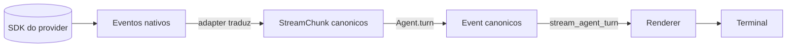
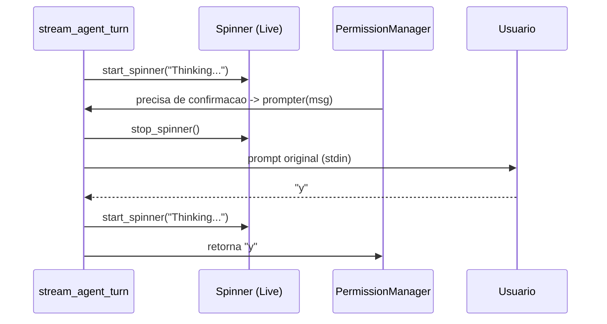

# Streaming

Esta pagina explica o **caminho completo** de um chunk: do SDK do provider
ate caracteres pintados no terminal. Tres modulos cooperam:

- [`vulpcode.providers.*`](../providers/index.md) — produz `StreamChunk` canonicos.
- [`vulpcode.agent`](agent-loop.md) — converte chunks em `Event`s de mais alto nivel.
- `vulpcode.ui.streaming` + `vulpcode.ui.render` — desenha cada evento via Rich.

---

## 1. Stream pipeline



| Etapa             | Modulo                            | Output                              |
|-------------------|-----------------------------------|-------------------------------------|
| Stream nativo     | SDK do provider                   | Eventos especificos do fornecedor   |
| Traducao          | `vulpcode.providers.<vendor>`     | `StreamChunk` (vide tabela abaixo)  |
| Agent loop        | `Agent.turn`                      | `TextEvent`, `ToolStartEvent`, ...  |
| Render            | `stream_agent_turn` + `Renderer`  | Caracteres no terminal              |

A fronteira entre **chunk** e **event** e importante:

- `StreamChunk` e o que o provider produz por chunk (granularidade do SDK).
- `Event` e o que o Agent emite — pode agregar varios chunks (ex.: tool calls
  fragmentadas em deltas viram um unico `ToolStartEvent`/`ToolEndEvent`).

---

## 2. StreamChunk types

Definidos em [`vulpcode.providers.base`](../api/providers.md):

| `type`            | Campos preenchidos          | Significado                                                  |
|-------------------|-----------------------------|--------------------------------------------------------------|
| `text`            | `delta: str`                | Fragmento de texto do assistant (streamado)                  |
| `tool_call`       | `tool_call: ToolCall`       | Tool call completa (id, name, arguments ja parseados)        |
| `tool_call_delta` | `raw: dict`                 | Payload parcial de tool call; raro, normalmente buffered     |
| `usage`           | `usage: Usage`              | Token accounting (input, output, cache_read, cache_creation) |
| `stop`            | `stop_reason: str`          | Fim do stream — `end_turn`, `tool_use`, `max_tokens`, ...    |
| `error`           | `error: str`                | Erro recuperavel reportado pelo SDK                          |

`StreamChunk` tem ainda um campo `raw: dict | None` que carrega o evento
nativo do SDK quando necessario para debugging.

> **Nota**: a maioria dos adapters **agrega** fragmentos de tool calls
> internamente e emite um unico `tool_call` ja completo. `tool_call_delta`
> existe para casos onde a API de stream nao da garantia de chegada — e
> raro na pratica.

---

## 3. Como o renderer roteia

[`stream_agent_turn`](https://github.com/vulpcode/vulpcode/blob/main/src/vulpcode/ui/streaming.py)
consome `agent.turn(...)` e despacha cada `Event` para o `Renderer`:

| Event              | Acao no Renderer                                       |
|--------------------|--------------------------------------------------------|
| `TextEvent`        | `render_text_chunk` — escreve o delta inline           |
| `ToolStartEvent`   | `render_tool_start` — Panel com args JSON + spinner    |
| `ToolEndEvent`     | `render_tool_end` — Panel verde (ok) ou vermelho (erro)|
| `ToolDeniedEvent`  | `render_tool_denied` — linha amarela de aviso          |
| `UsageEvent`       | `render_usage` — linha cinza com `tokens: in=X out=Y`  |
| `ErrorEvent`       | `render_error` — linha vermelha `error: ...`           |
| `TurnEndEvent`     | `render_turn_end` — sufixo se `stop_reason != end_turn`|

O `Renderer` mantem um flag `_streaming_active` para saber se acabou de
escrever um delta inline (sem `\n`). Antes de imprimir um Panel ou outro
bloco, ele emite um `\n` para nao colar o painel no fim do texto streamado.

Trecho real (`render_tool_start`):

```python
def render_tool_start(self, tool_call: ToolCall) -> None:
    if self._streaming_active:
        self.console.print()  # quebra linha apos texto streamado
        self._streaming_active = False
    args_pretty = json.dumps(tool_call.arguments, indent=2, ensure_ascii=False)
    body = Syntax(args_pretty, "json", theme=self.theme.code_theme, word_wrap=True)
    self.console.print(
        Panel(
            body,
            title=f"[{self.theme.accent}]{tool_call.name}[/]",
            subtitle=f"[{self.theme.muted}]running...[/]",
            border_style=self.theme.primary,
        )
    )
```

---

## 4. Spinner-aware prompter

Quando o Agent precisa pedir confirmacao para uma tool (`requires_confirm=True`
em modo `default`), o `PermissionManager` chama `permissions.prompter(msg, ctx)`
— uma corrotina que le do stdin.

Problema: o `Live(spinner)` do Rich **toma** o stdin enquanto roda. Se o
prompter for chamado com o spinner ativo, a entrada do usuario fica sumida
ou corrompida.

Solucao: `stream_agent_turn` instala um wrapper na hora:

```python
permissions = getattr(agent, "permissions", None)
original_prompter = getattr(permissions, "prompter", None) if permissions else None

if permissions is not None and original_prompter is not None:
    async def _spinner_aware_prompter(msg: str, ctx: dict) -> str:
        stop_spinner()
        try:
            return await original_prompter(msg, ctx)
        finally:
            start_spinner("Thinking...")

    permissions.prompter = _spinner_aware_prompter
```

O wrapper para o `Live`, chama o prompter original (que agora tem stdin
limpo), e religa o spinner depois. Um `try/finally` no fim de
`stream_agent_turn` restaura `permissions.prompter` ao original — assim
vidas longas (REPL multi-turno) nao acumulam wrappers.



---

## 5. Spinner: estados

`stream_agent_turn` mantem um `Live(Spinner("dots", text=...))` que e
parado e religado conforme os eventos:

| Evento recebido    | Acao no spinner                       |
|--------------------|---------------------------------------|
| inicio do turn     | `start_spinner("Thinking...")`        |
| `TextEvent`        | `stop_spinner()` (texto fluindo)      |
| `ToolStartEvent`   | `stop_spinner()` -> render -> `start_spinner("Running <name>...")` |
| `ToolEndEvent`     | `stop_spinner()` -> render -> `start_spinner("Thinking...")` |
| `ToolDeniedEvent`  | `stop_spinner()` -> render -> `start_spinner("Thinking...")` |
| `UsageEvent`       | (nao mexe no spinner)                 |
| `ErrorEvent`       | `stop_spinner()` -> render            |
| `TurnEndEvent`     | `stop_spinner()` -> render -> return  |

O parametro `spinner: bool = True` desliga isso por completo (usado em
`Repl.one_shot`, onde nao queremos mostrar spinner numa execucao
nao-interativa).

---

## 6. Diferencas de streaming entre providers

Cada SDK tem seu proprio formato de stream. O adapter normaliza tudo para
`StreamChunk`, mas vale conhecer os contornos:

| Provider     | Estilo de streaming                              | Tool calls                                                    |
|--------------|--------------------------------------------------|---------------------------------------------------------------|
| Anthropic    | SSE com eventos `RawMessage*` / `ContentBlock*`  | `input_json_delta` agregado por `index` ate `content_block_stop` |
| OpenAI       | SSE com `ChatCompletionChunk`                    | `tool_calls` em fragmentos por `index`, agregados ate `finish_reason` |
| Gemini       | `AsyncIterator` de `generate_content_stream`     | `function_call` chega completo (sem fragmentacao)             |
| Ollama       | NDJSON (uma linha JSON por chunk)                | `tool_calls` chegam completos no chunk                        |
| internal-llm | Sem streaming real — emite 1 `text` + `stop`     | Nao suporta tool calling                                      |

> Detalhes de cada adapter (modelos, quirks, mapeamento de `stop_reason`):
> ver **Provider translation** (em 10.02).

---

## Veja tambem

- [Agent loop](agent-loop.md) — quem produz os eventos que esta pagina renderiza.
- **Provider translation** (em 10.02) — quem produz os `StreamChunk`.
- [Providers](../providers/index.md) — referencia de cada provider e seus quirks.
- [API: Agent](../api/agent.md) — definicao tipada de cada `Event`.
