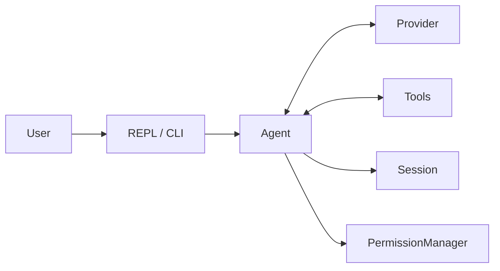
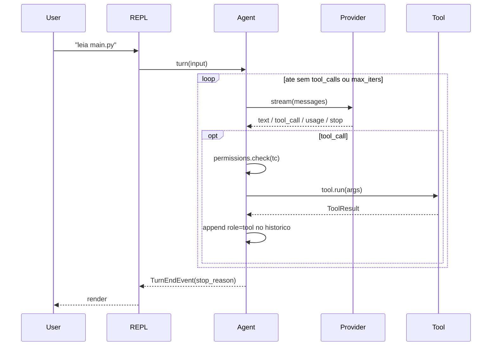

# Conceitos principais

Esta pagina apresenta o vocabulario do Vulpcode. E uma referencia conceitual,
nao um tutorial — para comandos, va para o [User Guide](../user-guide/slash-commands.md).

---

## Visao geral

Vulpcode tem um **Agent** que conversa com um **Provider** (Claude, GPT, Gemini,
Ollama, ...) e tem acesso a um conjunto de **Tools** (Read, Bash, Write, ...).
Quando o modelo decide usar uma tool, o **PermissionManager** decide se
executa, e a **Session** guarda o historico para retomar depois.



Cada conceito tem uma pagina dedicada — esta aqui e o mapa.

---

## 1. Provider

Um **Provider** e a abstracao que traduz o formato canonico do Vulpcode
(`Message`, schemas de tool, `StreamChunk`) para a API nativa de cada modelo.
Toda subclasse de `Provider` implementa `stream()` como async generator de
`StreamChunk` — e por ai que o Agent recebe texto, tool calls, contagem de
tokens e o `stop_reason`.

Existem tres categorias:

- **Dedicados**: cliente nativo da API. `anthropic`, `gemini`, `ollama`, `internal-llm`.
- **OpenAI-compativeis**: reusam `OpenAIProvider` com `base_url` diferente.
  `openai`, `deepseek`, `groq`, `openrouter`, `lmstudio`, `vllm`.
- **MCP**: servidores externos expoem **tools**, nao providers — ver secao 7.

Streaming e o caminho padrao em todos os providers; nao existe um modo
"sem streaming" exposto na API publica.

| Nome           | Categoria              | Tool calling | Visao |
|----------------|------------------------|:------------:|:-----:|
| `anthropic`    | dedicado               | sim          | sim   |
| `gemini`       | dedicado               | sim          | sim   |
| `ollama`       | dedicado (local)       | varia        | varia |
| `internal-llm` | dedicado (corporativo) | sim          | nao   |
| `openai`       | OpenAI-compativel      | sim          | sim   |
| `deepseek`     | OpenAI-compativel      | sim          | nao   |
| `groq`         | OpenAI-compativel      | sim          | varia |
| `openrouter`   | OpenAI-compativel      | varia        | varia |
| `lmstudio`     | OpenAI-compativel (local) | varia     | varia |
| `vllm`         | OpenAI-compativel (local) | varia     | varia |

> Detalhes por provider, modelos suportados e quirks: ver
> [Providers](../providers/index.md).

---

## 2. Tool

Uma **Tool** e uma capacidade que o Agent expoe ao modelo: ler um arquivo,
rodar um comando, buscar na web. Cada tool e uma subclasse de `Tool` decorada
com `@tool(...)`, que registra a classe em `TOOL_REGISTRY`:

```python
from pydantic import BaseModel
from vulpcode.tools import Tool, ToolResult, tool

@tool(
    name="Hello",
    description="Diz ola para um nome.",
    requires_confirm=False,
)
class HelloTool(Tool):
    class Input(BaseModel):
        name: str

    async def run(self, args: "HelloTool.Input") -> ToolResult:
        return ToolResult(output=f"hello {args.name}")
```

Componentes:

- **`name`** — chave unica usada pelo modelo nas tool calls.
- **`Input`** (Pydantic v2) — schema dos argumentos. Convertido para JSON
  Schema via `Tool.to_schema()` e enviado ao provider.
- **`run(args) -> ToolResult`** — corpo da tool. `ToolResult` carrega
  `output`, `error`, `is_error` e `metadata`.
- **`requires_confirm`** — se `True`, passa pelo `PermissionManager` antes
  de executar.

O Agent descobre as tools via `TOOL_REGISTRY` (em `vulpcode.tools.base`) na
hora da construcao — basta importar o modulo da tool para registra-la.

### Tools nativas (14)

| Categoria        | Tools                                    |
|------------------|------------------------------------------|
| Arquivos         | `Read`, `Write`, `Edit`, `MultiEdit`     |
| Busca            | `Glob`, `Grep`                           |
| Shell            | `Bash`, `BashOutput`, `KillBash`         |
| Web              | `WebFetch`, `WebSearch`                  |
| Agentic          | `Task`, `TodoWrite`                      |
| Notebooks        | `NotebookEdit`                           |

> Referencia detalhada de cada tool: ver [Tools](../tools/index.md).

---

## 3. Agent loop

O **Agent** orquestra o ciclo classico: pede o turno ao provider, coleta
texto e tool calls do stream, executa as tools aprovadas, anexa os resultados
ao historico e repete ate o modelo parar.

Detalhes operacionais:

- O loop e limitado por `Agent._max_iters = 25` (proteger contra loops infinitos
  causados por uma tool que nunca satisfaz o modelo).
- O historico canonico vive em `Agent._messages: list[Message]`.
- Cada iteracao consome um stream completo (`Provider.stream(...)`) e produz
  uma mensagem `assistant` no historico, possivelmente com `tool_calls`.

### Eventos emitidos

Para a UI (REPL, headless, etc.), `Agent.turn()` e um async iterator de
eventos tipados:

| Evento              | Quando                                              |
|---------------------|-----------------------------------------------------|
| `TextEvent`         | Cada delta de texto que o provider streamou         |
| `ToolStartEvent`    | Antes de `tool.run(args)` (depois de aprovar)       |
| `ToolEndEvent`      | Depois de `tool.run(args)` (com `ToolResult`)       |
| `ToolDeniedEvent`   | Permission manager negou a tool call                |
| `UsageEvent`        | Provider reportou `input_tokens` / `output_tokens`  |
| `TurnEndEvent`      | Modelo parou sem mais tool calls (`stop_reason`)    |
| `ErrorEvent`        | Erro de stream, tool desconhecida ou `max_iters`    |

### Diagrama de sequencia



> Detalhes da arquitetura: ver [Agent loop](../architecture/agent-loop.md).

---

## 4. Permissoes

O **PermissionManager** decide, para cada tool call, se a execucao prossegue.
A decisao depende do **Mode** ativo e do flag `requires_confirm` da tool.

| Mode      | Comportamento                                                            |
|-----------|--------------------------------------------------------------------------|
| `default` | Pede confirmacao para tools com `requires_confirm=True`                  |
| `auto`    | Aprova tudo sem perguntar                                                |
| `safe`    | Forca confirmacao em **todas** as tools (ate `Read`)                     |
| `plan`    | Bloqueia toda execucao (modo somente-leitura para planejamento)          |

No prompt de confirmacao:

- `y` — aprova esta chamada apenas.
- `a` — aprova **sempre** essa tool nesta sessao (allowlist em memoria).
- `n` — rejeita; o modelo recebe a recusa como resultado da tool.

A allowlist persistente vive em `~/.vulpcode/config.toml`:

```toml
[permissions]
always_allow_tools = ["Read", "Glob", "Grep"]
```

> Configuracao completa: ver [Permissoes](../user-guide/permission-modes.md).

---

## 5. Sessao

O historico canonico (`Agent._messages`) pode ser persistido em disco como
JSON em `~/.vulpcode/sessions/<nome>.json`. Cada sessao guarda provider,
modelo, system prompt, mensagens e contagem acumulada de tokens.

| Acao             | Como                                                       |
|------------------|------------------------------------------------------------|
| Salvar           | `/save <nome>` no REPL                                     |
| Carregar         | `/load <nome>` no REPL                                     |
| Listar           | `vulp sessions` no shell                                   |
| Retomar a ultima | `vulp --resume`                                            |
| Apagar           | `delete_session(name)` em codigo, ou apagar o arquivo JSON |

O nome e sanitizado (apenas alfanumerico, `-` e `_`); colisoes sobrescrevem
o arquivo anterior atomicamente (write to `.tmp` + rename).

> Comandos `/save`, `/load` e `--resume`: ver
> [Sessoes](../user-guide/sessions.md).

---

## 6. MCP

**MCP (Model Context Protocol)** estende o `TOOL_REGISTRY` com tools servidas
por processos externos. Para o Agent, uma tool MCP se comporta exatamente
como uma nativa — ela aparece no schema enviado ao provider, passa pelo
`PermissionManager` e gera os mesmos eventos.

Configuracao em `~/.vulpcode/config.toml`:

```toml
[[mcp.servers]]
name = "filesystem"
command = "npx"
args = ["-y", "@modelcontextprotocol/server-filesystem", "/tmp"]
```

> Servidores suportados, transports e exemplos: ver [MCP](../mcp/index.md).

---

## 7. Streaming, tokens e limites

Todo turno e tokenizado pelo provider, e o Vulpcode acumula a contagem em
`Agent._session_usage` (uma instancia de `Usage`):

| Campo                   | Significado                                       |
|-------------------------|---------------------------------------------------|
| `input_tokens`          | Tokens enviados ao modelo no turno                |
| `output_tokens`         | Tokens gerados pelo modelo                        |
| `cache_read_tokens`     | Tokens lidos do prompt cache (Anthropic, ...)     |
| `cache_creation_tokens` | Tokens gravados no prompt cache                   |

`max_tokens` (default `16384`) controla o teto de geracao por turno e e
configuravel em `~/.vulpcode/config.toml`:

```toml
[model_settings]
max_tokens = 8192
```

No fim do stream, o provider emite um chunk `stop` com `stop_reason`. Os
valores observaveis no `TurnEndEvent` incluem:

- `end_turn` — modelo terminou normalmente.
- `tool_use` — modelo solicitou tool calls (o loop continua).
- `max_tokens` — teto de tokens atingido (resposta truncada).
- `stop_sequence` — alguma das `stop_sequences` configuradas foi gerada.

> Modelos, contextos e limites por provider: ver
> [Providers](../providers/index.md).
